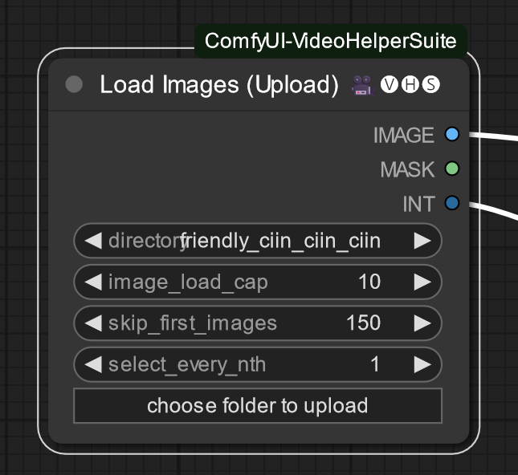

# sesopenko/fizz_node_batch_reschedule

Reschedules a batch of keyframe directives used by [ComfyUI FizzNodes](https://github.com/FizzleDorf/ComfyUI_FizzNodes).

When skipping frames in an animation, the key frames have to be rescheduled based on the number of key frames skipped.

It's helpful to render video in ComfyUI in batches, to get past VRAM limitations. However, this leaves messes up with
the schedule for ComfyUI FizzNodes. Using this tool, you can feed in the values from a batch prompt schedule as well as 
from ValueSchedule nodes (up to 4), and reschedule them to align with your `skip_first_images` from VHS Load Images.

## Example

Given the following schedule for Batch Prompt Schedule:

```
"0" :"(smile:`pw_a`), (mouth open:`pw_c`),",
"50":"(smile:`pw_a`), (mouth open:`pw_c`),boots (white and black, leather)",
"164":"((smile:`pw_a`), (mouth open:`pw_c`),wink:1)",
"181":"(smile:`pw_a`), (mouth open:`pw_c`),(wink:0.2)",
"210":"(smile:`pw_a`), (mouth open:`pw_c`),pointing fingers up",
"212":"(smile:`pw_a`), (mouth open:`pw_c`),",
"215":"(smile:`pw_a`), (mouth open:`pw_c`),pointing fingers down",
"228":"(smile:`pw_a`), (mouth open:`pw_c`),",
"240":"(smile:`pw_a`), (mouth open:`pw_c`),pointing finger up",
"255":"(smile:`pw_a`), (mouth open:`pw_c`),",
"256":"(smile:`pw_a`), (mouth open:`pw_c`),open palms",
"279":"(smile:`pw_a`), (mouth open:`pw_c`),",
"285":"(smile:`pw_a`), (mouth open:`pw_c`),pointing finger up",
"286":"(smile:`pw_a`), (mouth open:`pw_c`),",
"293":"(smile:`pw_a`), (mouth open:`pw_c`),pointing finger",
"303":"(smile:`pw_a`), (mouth open:`pw_c`),",
"359":"(smile:`pw_a`), (mouth open:`pw_c`),hands closed",
"367":"(smile:`pw_a`), (mouth open:`pw_c`),hands closed, cute cat paws pose",
"372":"(smile:`pw_a`), (mouth open:`pw_c`),hands closed",
"379":"(smile:`pw_a`), (mouth open:`pw_c`),hands closed, cute cat paws pose",
"382":"(smile:`pw_a`), (mouth open:`pw_c`),",
"391":"(smile:`pw_a`), (mouth open:`pw_c`),palms open, palms facing away",
"394":"(smile:`pw_a`), (mouth open:`pw_c`),palms open, hands out",
"421":"(smile:`pw_a`), (mouth open:`pw_c`),hands in animal poses",
"422":"(smile:`pw_a`), (mouth open:`pw_c`),",
"446":"(smile:`pw_a`), (mouth open:`pw_c`),finger pointing",
"448":"(smile:`pw_a`), (mouth open:`pw_c`),",
"450":"(smile:`pw_a`), (mouth open:`pw_c`),finger faised",
"453":"(smile:`pw_a`), (mouth open:`pw_c`),licking lips",
"469":"(smile:`pw_a`), (mouth open:`pw_c`),licking lips, hand in ok pose",
"473":"(smile:`pw_a`), (mouth open:`pw_c`),hand in ok pose",
"477":"(smile:`pw_a`), (mouth open:`pw_c`),wink",
"491":"(smile:`pw_a`), (mouth open:`pw_c`),"
```

Let's say you've set your VHS Load Images node to `skip_first_images` at `150`, skipping the first 150 frames. If you
use the same schedule, it won't skip keyframes `0` and `50` and the other keyframes will be mistimed.



Copy your prompt schedule to `main_sched.txt` and then run `batch_reschedule.exe`, passing in the amount of frames
you've skipped:

```
batch_reschedule 150
```

It will then output the following:

```
"0":"(smile:`pw_a`), (mouth open:`pw_c`),boots (white and black, leather)",
"14":"((smile:`pw_a`), (mouth open:`pw_c`),wink:1)",
"31":"(smile:`pw_a`), (mouth open:`pw_c`),(wink:0.2)",
"60":"(smile:`pw_a`), (mouth open:`pw_c`),pointing fingers up",
"62":"(smile:`pw_a`), (mouth open:`pw_c`),",
"65":"(smile:`pw_a`), (mouth open:`pw_c`),pointing fingers down",
"78":"(smile:`pw_a`), (mouth open:`pw_c`),",
"90":"(smile:`pw_a`), (mouth open:`pw_c`),pointing finger up",
"105":"(smile:`pw_a`), (mouth open:`pw_c`),",
"106":"(smile:`pw_a`), (mouth open:`pw_c`),open palms",
"129":"(smile:`pw_a`), (mouth open:`pw_c`),",
"135":"(smile:`pw_a`), (mouth open:`pw_c`),pointing finger up",
"136":"(smile:`pw_a`), (mouth open:`pw_c`),",
"143":"(smile:`pw_a`), (mouth open:`pw_c`),pointing finger",
"153":"(smile:`pw_a`), (mouth open:`pw_c`),",
"209":"(smile:`pw_a`), (mouth open:`pw_c`),hands closed",
"217":"(smile:`pw_a`), (mouth open:`pw_c`),hands closed, cute cat paws pose",
"222":"(smile:`pw_a`), (mouth open:`pw_c`),hands closed",
"229":"(smile:`pw_a`), (mouth open:`pw_c`),hands closed, cute cat paws pose",
"232":"(smile:`pw_a`), (mouth open:`pw_c`),",
"241":"(smile:`pw_a`), (mouth open:`pw_c`),palms open, palms facing away",
"244":"(smile:`pw_a`), (mouth open:`pw_c`),palms open, hands out",
"271":"(smile:`pw_a`), (mouth open:`pw_c`),hands in animal poses",
"272":"(smile:`pw_a`), (mouth open:`pw_c`),",
"296":"(smile:`pw_a`), (mouth open:`pw_c`),finger pointing",
"298":"(smile:`pw_a`), (mouth open:`pw_c`),",
"300":"(smile:`pw_a`), (mouth open:`pw_c`),finger faised",
"303":"(smile:`pw_a`), (mouth open:`pw_c`),licking lips",
"319":"(smile:`pw_a`), (mouth open:`pw_c`),licking lips, hand in ok pose",
"323":"(smile:`pw_a`), (mouth open:`pw_c`),hand in ok pose",
"327":"(smile:`pw_a`), (mouth open:`pw_c`),wink",
"341":"(smile:`pw_a`), (mouth open:`pw_c`),"
```

Notice that `boots (white and black, leather)` is now the first key frame, and numbered at `0`.  All the other keyframes
have been renumbered as well, accordingly.

You can place your value schedules into `a.txt`, `b.txt`, `c.txt` and `d.txt` accordingly, and it will reschedule
those as well:

Example `a.txt`:

```
0:(0),
3:(0.1),
5:(0.8),
14:(0.3),
18:(0),
154:(0),
155:(0.3),
156:(0.8),
157:(1),
191:(0.4),
197:(0.2),
199:(0.1),
200:(0)
```

After reschedule by 150 frames:

```
"0":(0),
"4":(0),
"5":(0.3),
"6":(0.8),
"7":(1),
"41":(0.4),
"47":(0.2),
"49":(0.1),
"50":(0)
```

Paste in the values into `pw_a`, `pw_b`, `pw_c` and `pw_d` accordingly. Refer to the documentation from FizzNodes on
how to use value schedules in general.

## Usage (Windows):

Download the project from github and extract it to a folder (or use git to clone it if you have git).

From windows terminal:

```bat
REM copy all example files into source files using prep.bat
prep.bat
REM run program and skip 150 frames. Adjust to the skip for your given batch.
batch_reschedule 150
```

### Linux support

Theoretically this should work on linux if you build it with similar steps. See what [prep.bat](prep.bat) is doing.

## License

Licenced under Apache version 2.0. The license is included in [LICENSE-2.0.txt](LICENSE-2.0.txt)

## Copyright

Copyright (c) Sean Esopenko 2023